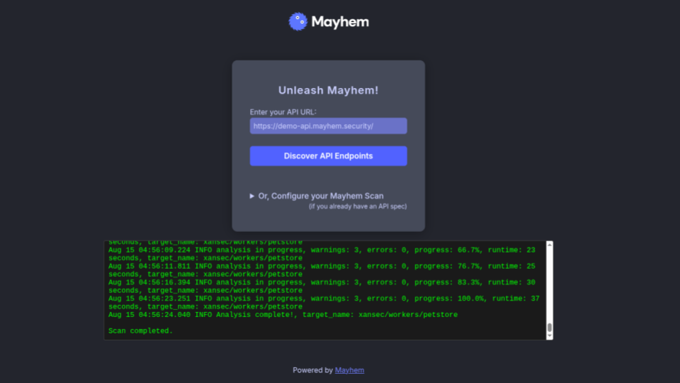

# Mapi Cloudflare Container

Run API fuzzing natively in the browser with Cloudflare Containers!

[](https://deploy.workers.cloudflare.com/?url=https://github.com/xansec/mapi-worker-example/)



## Mayhem for API Worker Example
This is a Cloudflare Worker application that uses the [Containers](https://developers.cloudflare.com/containers/) feature to run a Mayhem API fuzzing engine directly from your browser, without needing to set up any backend infrastructure.

## Prerequisites

You'll need a Mayhem API token to use this application. You can get one by signing up for free at [Mayhem](https://app.mayhem.security/).

You can set local secrets in a `.env` file in the root of the project. The file should contain your Mayhem API token:

```
MAYHEM_URL=https://app.mayhem.security
MAYHEM_TOKEN=<token>
```
(You can do this in production by running, for example, `npx wrangler secret put MAYHEM_URL`)


Then, install dependencies:

```bash
npm install
```

## Running the Application Locally

To run the development server:

```bash
npx wrangler dev --local
```

Open [http://localhost:8787](http://localhost:8787) with your browser to see the application.

From here, you can select an API URL and select discover to find endpoints. Once you have an endpoint file (check the terminal output), you can configure your scan parameters and start running Mayhem.

## Deploying To Production

| Command          | Action                                |
| :--------------- | :------------------------------------ |
| `npx wrangler deploy` | Deploy your application to Cloudflare |

You can also deploy to production using the Cloudflare dashboard by clicking the "Deploy to Cloudflare" button at the top of this README.