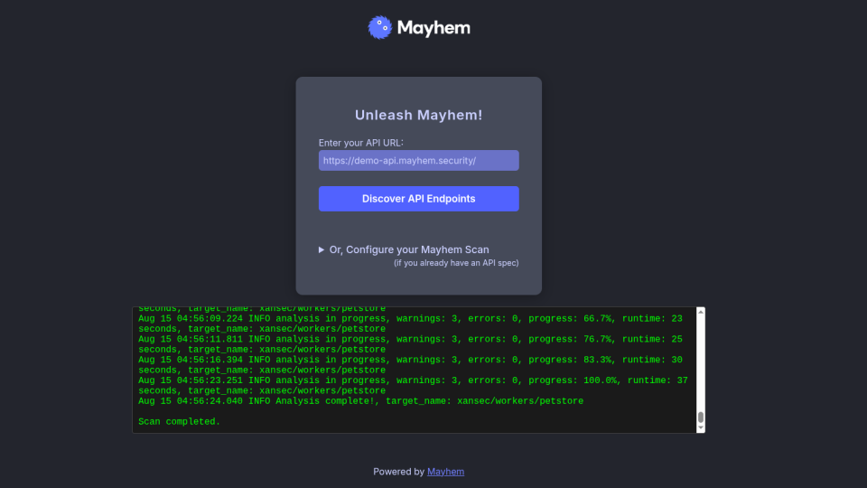
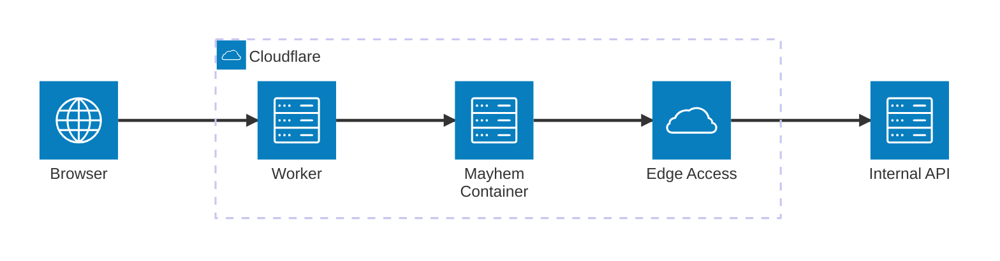

# mAPI Cloudflare Container

Run API fuzzing natively in the browser with Cloudflare Containers!

[](https://deploy.workers.cloudflare.com/?url=https://github.com/xansec/mapi-worker-example/)



## Mayhem for API Worker Example
This is a Cloudflare Worker application that uses the [Containers](https://developers.cloudflare.com/containers/) feature to run a Mayhem API fuzzing engine directly from your browser, without needing to set up any backend infrastructure.

## Prerequisites

You'll need a Mayhem API token to use this application. You can get one by signing up for free at [Mayhem](https://app.mayhem.security/).

Create a `.dev.vars` file in the root of the project with your Mayhem credentials:

```bash
MAYHEM_URL=https://app.mayhem.security
MAYHEM_TOKEN=<token>
# Set these if you are using tunnels for testing
CF_ACCESS_CLIENT_ID=
CF_ACCESS_CLIENT_SECRET=
```

Then, install dependencies:

```bash
npm install
```

## Running the Application Locally

To run the development server:

```bash
npx wrangler dev --local
```

Open [http://localhost:8787](http://localhost:8787) with your browser to see the application.

From here, you can select an API URL and select discover to find endpoints. Once you have an endpoint file (check the terminal output), you can configure your scan parameters and start running Mayhem.

## Deploying To Production

You can deploy this application to Cloudflare by running:

```bash
npx wrangler deploy
```

Set your production secrets after deploying:

```bash
npx wrangler secret put MAYHEM_URL
npx wrangler secret put MAYHEM_TOKEN
# Optional: only if using tunnels
npx wrangler secret put CF_ACCESS_CLIENT_ID
npx wrangler secret put CF_ACCESS_CLIENT_SECRET
```

You can also deploy to production using the Cloudflare dashboard by clicking the "Deploy to Cloudflare" button at the top of this README.

## Testing Internal APIs with Cloudflare Tunnel (ZTNA)

This worker runs inside Cloudflare's network, which means it can reach any API exposed via a **cloudflared tunnel** — including APIs on your private network that are not publicly accessible. This is known as [Zero Trust Network Access (ZTNA)](https://www.cloudflare.com/learning/access-management/what-is-ztna/).

### Quick Tunnel

First, you'll need to install [Cloudflare's Tunnel CLI](https://developers.cloudflare.com/cloudflare-one/networks/connectors/cloudflare-tunnel/downloads/).

The easiest way to expose a local or internal API for testing is to run:

```bash
cloudflared tunnel --url http://localhost:PORT
```

Cloudflare will print a temporary public URL like `https://<random>.trycloudflare.com`. Paste that as your API URL in the UI.

### Named Tunnel with Cloudflare Access (production ZTNA)

For persistent tunnels with access control:

1. Login and create your tunnel:
   ```bash
   cloudflared login
   cloudflared tunnel create my-internal-api
   cloudflared tunnel route dns my-internal-api internal-api.example.com
   ```

2. Configure the tunnel (in `~/.cloudflared/config.yml`):
   ```yaml
   tunnel: <tunnel-id>
   credentials-file: ~/.cloudflared/<tunnel-id>.json
   ingress:
     - hostname: internal-api.example.com
       service: http://localhost:PORT
     - service: http_status:404
   ```

3. Run the tunnel:
   ```bash
   cloudflared tunnel run my-internal-api
   ```

4.Create a Cloudflare Access application for `internal-api.example.com` in the [Cloudflare Zero Trust dashboard](https://one.dash.cloudflare.com/), then create a Service Token under Access -> Service Auth.

5. Set the service token as Worker secrets:
   ```bash
   npx wrangler secret put CF_ACCESS_CLIENT_ID
   npx wrangler secret put CF_ACCESS_CLIENT_SECRET
   ```

The Mayhem container will automatically inject the `CF-Access-Client-Id` and `CF-Access-Client-Secret` headers on every request it makes to the target API, allowing it to pass through the Access gate.

### Architecture


```mermaid
architecture-beta
    group cf(cloud)[Cloudflare]
        service worker(server)[Worker] in cf
        service container(server)[Mayhem Container] in cf
        service edge(cloud)[Edge Access] in cf

    service browser(internet)[Browser]
    
    service api(server)[Internal API]

    browser:R --> L:worker
    worker:R --> L:container
    container:R --> L:edge
    edge:R --> L:api
```